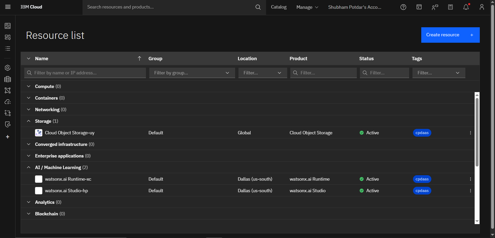
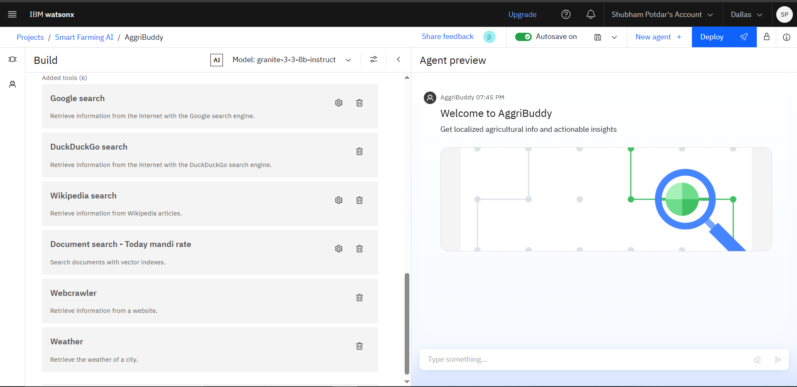
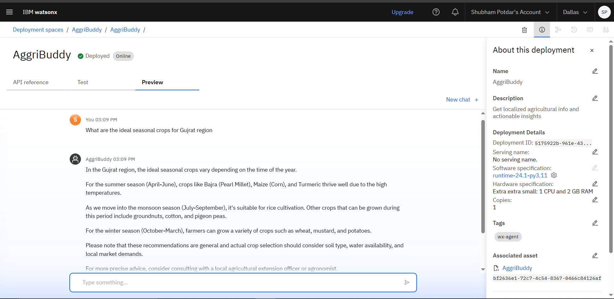
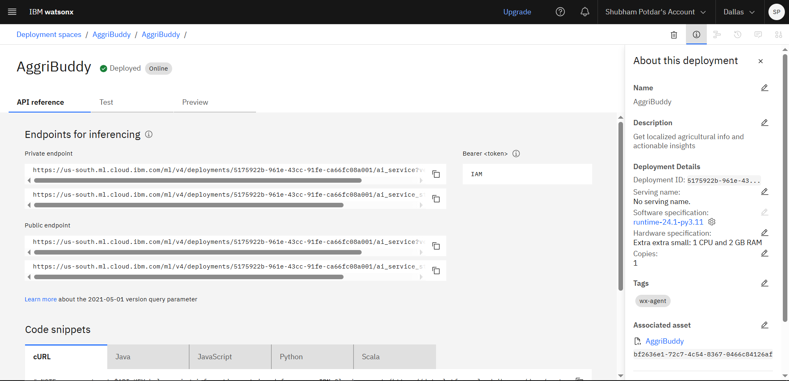
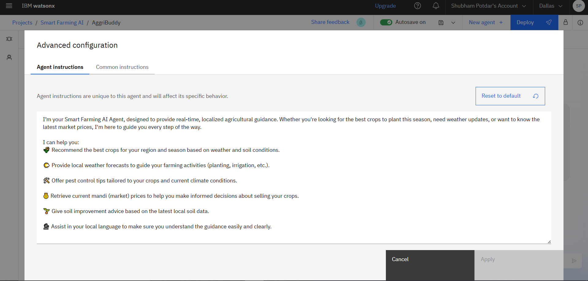

<div align="center">

# 🌾 AgriBuddy
### An AI Agent for Smart Farming Advice

**AI-powered farming assistant using IBM Watsonx + RAG that delivers real-time, localized crop advice, pest alerts & mandi prices in regional languages — built for India's 100 million small & marginal farmers.**

<br/>

[](https://python.org)
[](https://www.ibm.com/products/watsonx)
[](https://github.com/Shubh07x/AggriBuddy-An-AI-Agent-for-Smart-Farming-Advice)
[](LICENSE)
[](https://skillsbuild.org)

<br/>


</div>

---

## 🚀 What is AgriBuddy?

> **AgriBuddy** is an AI agent built on **IBM Watsonx.ai** and **Retrieval-Augmented Generation (RAG)** that answers real farming questions in simple, regional language — so a farmer in Kolhapur can ask *"Which crop should I grow in August?"* and get a grounded, trusted answer instantly.

Most farming apps are built for smartphones and English speakers. AggriBuddy is built for **real farmers** — vernacular support, trusted document-grounded answers, and zero hallucination.

---

## 🧩 The Problem

| Challenge | Impact |
|-----------|--------|
| No timely crop guidance | Farmers grow wrong crops for the season |
| Unknown pest & disease outbreaks | Crop losses up to 40% |
| No access to mandi (market) prices | Farmers sell at exploitative rates |
| Language & literacy barriers | Government advisories go unread |

---

## 💡 The Solution

<div align="center">

```
Farmer asks a question (Hindi / Marathi / English)
            ↓
   IBM Granite LLM processes query
            ↓
  Vector Index fetches grounded info
  from trusted agricultural PDFs
            ↓
  Agent responds in simple language
  with season & region-specific advice
```

</div>

---

## 🧠 Tech Stack

| Layer | Technology |
|-------|-----------|
| **LLM** | IBM Granite Foundation Model |
| **Agent Framework** | IBM Watsonx.ai Studio |
| **RAG / Knowledge Base** | Watsonx Vector Index + IBM Cloud Object Storage |
| **NLP** | Natural Language Processing (multilingual) |
| **Deployment** | IBM Cloud Lite → Web UI / Streamlit |
| **Auth** | IBM Cloud IAM |

---

## ✨ Key Features

- 🌐 **Multilingual** — Supports Hindi, Marathi, and English queries
- 🌱 **Personalized crop advice** — Region & season specific recommendations
- 🐛 **Pest & disease alerts** — From trusted agricultural datasets
- 📈 **Daily mandi prices** — Pulled from official government sources
- 🤖 **Grounded answers** — RAG ensures zero hallucination
- 🛡️ **Off-topic redirection** — Stays focused on farming only

---

## 📸 Screenshots
### Resources

### Tools & Testing


### Deployment & Preview


### API References


### Setting Up the Agent


### Agent Instructions


---

## 🚀 How to Run

### Prerequisites
- IBM Cloud Lite Account (free)
- Python 3.10+

### Steps

```bash
# 1. Clone the repository
git clone https://github.com/Shubh07x/AggriBuddy-An-AI-Agent-for-Smart-Farming-Advice.git
cd AggriBuddy-An-AI-Agent-for-Smart-Farming-Advice

# 2. Install dependencies
pip install -r requirements.txt

# 3. Set up environment variables
cp .env.example .env
# Add your IBM Cloud API Key in .env

# 4. Run the notebook
jupyter notebook AggriBuddy_Standard_Notebook.ipynb
```

### Environment Variables

```env
IBM_API_KEY=your_ibm_cloud_api_key
WATSONX_PROJECT_ID=your_project_id
IBM_CLOUD_URL=https://us-south.ml.cloud.ibm.com
```

---

## 👥 Who Is This For?

| User | Use Case |
|------|----------|
| 🧑‍🌾 Small & marginal farmers | Daily crop & weather queries |
| 🏢 Agricultural cooperatives | Bulk advisory distribution |
| 🏛️ Government Krishi Kendras | Automated farmer helpdesk |
| 🌍 NGOs & AgriTech Startups | Last-mile AI integration |
| 👨‍💼 Rural Extension Officers | Field decision support |

---

## 🛣️ Future Scope

- [ ] 🌾 Crop disease detection with image processing
- [ ] 🎙️ Voice assistant in local dialects
- [ ] 📶 Offline access for remote areas
- [ ] 🐓 Livestock support system
- [ ] 💰 Financial & crop insurance suggestions
- [ ] 🌍 IoT farm sensor data integration

---

## 📁 Project Structure

```
AggriBuddy/
├── AggriBuddy_Standard_Notebook.ipynb   # Main AI agent notebook
├── assets/                              # UI assets
├── assettypes/                          # Asset type configs
├── project.json                         # Project configuration
├── requirements.txt                     # Python dependencies
├── README.md                            # You are here
└── screenshots/
    ├── farmai.png
    ├── Deployment_preview.png
    ├── agent_instruction.png
    ├── otool_testing.png
    ├── API.png
    └── resource_list.png
```

---

## 🔗 Resources

- [IBM Cloud Lite (Free)](https://cloud.ibm.com)
- [IBM Watsonx.ai](https://www.ibm.com/products/watsonx)
- [IBM SkillsBuild](https://skillsbuild.org)
- [IBM Granite Models](https://www.ibm.com/granite)

---

## ⚖️ License

This project is licensed under the **MIT License** — see [LICENSE](LICENSE) for details.

---

<div align="center">

## 🙋‍♂️ Author

**Shubham Dattatray Potdar**

D. Y. Patil College of Engineering and Technology, Kolhapur
Department of Computer Science and Engineering

[](https://www.linkedin.com/in/shubhampotdar07x)
[](https://github.com/Shubh07x)

<br/>

*Created with 💙 during the IBM SkillsBuild for Academic Internship 2025*

</div>
